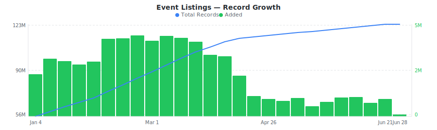
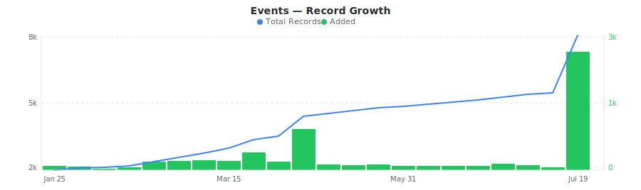
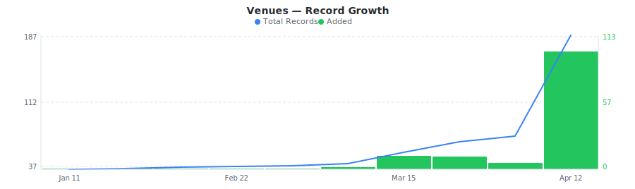

# StubHub Ticket Marketplace Dataset

&nbsp;&nbsp;[](https://rebrowser.net/products/datasets/stubhub)

Daily snapshots of StubHub resale ticket listings, events, and venues with seating details, delivery types, and availability data across sports, concerts, and theater.


This repository contains a preview sample of the [StubHub dataset](https://rebrowser.net/products/datasets/stubhub) published by Rebrowser. If you're doing academic research, you may be eligible for free access to a much larger slice — see [Free Datasets for Research](https://rebrowser.net/free-datasets-for-research).


This dataset contains **3** entities, each in its own folder: Event Listings (`event-listings`), Events (`events`), Venues (`venues`). See below for a full field breakdown, sample counts, and data distributions for each.

*Found this useful? ⭐ Star this repo to help us keep publishing fresh data. Found an error? [Let us know](https://rebrowser.net/contact-us).*


---

### Event Listings
Per-event ticket listings from StubHub with section, row, seat, quantity, delivery type, ticket class, and creation timestamp.


> **113,557,700** total records from 2024-03-31 to 2026-04-12, **up to 30,000** rows in this sample (0.03% of full dataset).
> Exported as one file per day, up to 1,000 rows each, last 30 days retained.



| Field | Type | Fill Rate | Description |
| --- | --- | --- | --- |
| `_primaryKey` | `string` | 100% | Unique identifier for this record |
| `_firstSeenAt` | `datetime` | 100% | First time this record was seen |
| `_lastSeenAt` | `datetime` | 100% | Last time this record was updated |
| `listingId` | `string` | 100% | Unique listing ID (numeric, e.g., 9833690568) |
| `eventId` | `string` | 100% | Event ID this listing belongs to (join with stubhub_events) |
| `price` 🔒 | `float` | 100% | Ticket price in dollars including all fees (e.g., 212.35) |
| `faceValue` 🔒 | `float` | 86% | Face value of ticket in dollars (original printed price, 0 or null if not available) |
| `section` | `string` | 100% | Section name/number (e.g., 116, 325, 104) |
| `row` | `string` | 90% | Row within section - letter (A, B, GG), numeric (1-20+), or null if unassigned |
| `seat` | `string` | 53% | Seat range (e.g., "5_6", "1_6", "12_13") or null if unassigned |
| `seatFrom` | `string` | 35% | Starting seat number (e.g., "1", "5", "12") |
| `seatTo` | `string` | 13% | Ending seat number (e.g., "6", "13") |
| `quantity` | `float` | 100% | Number of tickets available in this listing (1-25, typically 2-8) |
| `availableQuantities` | `array` | 100% | Purchasable quantities (e.g., [1,2,3,4] means you can buy 1, 2, 3, or 4 tickets) |
| `ticketClass` | `float` | 100% | Ticket class ID (e.g., 594=Lower, 407=Upper, 954=Upper Level) |
| `ticketClassName` | `string` | 100% | Ticket class name (Lower, Upper, Mezzanine, Club Level, Plaza Level, etc.) |
| `ticketTypeId` | `float` | 100% | Ticket type ID (10=Mobile Transfer, 11=Mobile, 9=Mobile Entry, 1=Print-at-Home) |
| `ticketTypeName` | `string` | 100% | Ticket delivery type (Mobile Transfer ticket, Mobile ticket, Print-at-Home ticket) |
| `listingTypeId` | `float` | 100% | Listing type ID (1=standard ~95%, 14=other ~5%) |
| `starRating` 🔒 | `float` | 99% | Deal star rating 1-5 (5=best deal, null ~0.5-11% of listings) |
| `dealScore` 🔒 | `float` | 98% | Deal quality score 0-10 (e.g., 9.676, higher=better value) |
| `discount` 🔒 | `float` | 68% | Discount factor vs avg price (e.g., 0.798=~80% off avg, negative=above avg) |
| `seatQualityScore` 🔒 | `float` | 98% | Seat quality score (e.g., 4.533, higher=better seat position) |
| `isSeatedTogether` | `bool` | 100% | Whether tickets are seated together (true ~94-96%, false ~4-6%) |
| `isSpeculativeRow` | `bool` | 100% | Whether row is speculative/unconfirmed (true ~1-4%, false ~96-99%) |
| `listingNotes` | `array` | 100% | Listing notes/disclosures (Clear view, Front Row of Section, Limited view, Aisle seat, etc.) |
| `createdAt` | `datetime` | 100% | Listing creation timestamp |


> 🔒 **Premium fields** are included in the data files but their values are replaced with `[PREMIUM]`. To access real values, [use our website](https://rebrowser.net/products/datasets/stubhub).


#### Field Distributions


<details>
<summary><strong>Delivery Type Distribution</strong> (<code>ticketTypeName</code>)</summary>


| Value | Count | Share |
| --- | --- | --- |
| Mobile Transfer ticket | 81,056,642 | `██████████████░░░░░░` 71.4% |
| Mobile ticket | 29,865,752 | `█████░░░░░░░░░░░░░░░` 26.3% |
| Print-at-Home ticket | 1,251,373 | `░░░░░░░░░░░░░░░░░░░░` 1.1% |
| Ticket delivery method: Mobile Transfer | 372,921 | `░░░░░░░░░░░░░░░░░░░░` 0.3% |
| Delivery method: Mobile Transfer | 370,001 | `░░░░░░░░░░░░░░░░░░░░` 0.3% |
| Delivery method: Mobile | 198,905 | `░░░░░░░░░░░░░░░░░░░░` 0.2% |
| Ticket delivery method: Mobile | 198,197 | `░░░░░░░░░░░░░░░░░░░░` 0.2% |
| Physical ticket | 175,935 | `░░░░░░░░░░░░░░░░░░░░` 0.2% |
| Delivery method: Print-at-Home | 6,370 | `░░░░░░░░░░░░░░░░░░░░` 0.0% |
| Ticket delivery method: Print-at-Home | 6,305 | `░░░░░░░░░░░░░░░░░░░░` 0.0% |

</details>


<details>
<summary><strong>Top Ticket Classes</strong> (<code>ticketClassName</code>)</summary>


| Value | Count | Share |
| --- | --- | --- |
| Upper | 24,875,066 | `████████░░░░░░░░░░░░` 42.4% |
| Lower | 15,172,838 | `█████░░░░░░░░░░░░░░░` 25.8% |
| Balcony | 4,419,768 | `██░░░░░░░░░░░░░░░░░░` 7.5% |
| Upper Level | 2,674,923 | `█░░░░░░░░░░░░░░░░░░░` 4.6% |
| Middle | 2,394,333 | `█░░░░░░░░░░░░░░░░░░░` 4.1% |
| Floor | 2,140,278 | `█░░░░░░░░░░░░░░░░░░░` 3.6% |
| Mezzanine | 2,085,070 | `█░░░░░░░░░░░░░░░░░░░` 3.6% |
| Upper Tier | 1,668,123 | `█░░░░░░░░░░░░░░░░░░░` 2.8% |
| 200 Level | 1,656,605 | `█░░░░░░░░░░░░░░░░░░░` 2.8% |
| Orchestra | 1,633,297 | `█░░░░░░░░░░░░░░░░░░░` 2.8% |

</details>


---

### Events
Daily snapshot of StubHub events with start time, venue ID, availability state, and event type flags for market-level tracking.


> **6,912** total records from 2025-10-05 to 2026-04-12, **up to 6,912** rows in this sample (100.0% of full dataset).
> Exported as one file per day, up to 1,000 rows each, last 30 days retained.



| Field | Type | Fill Rate | Description |
| --- | --- | --- | --- |
| `_primaryKey` | `string` | 100% | Unique identifier for this record |
| `_firstSeenAt` | `datetime` | 100% | First time this record was seen |
| `_lastSeenAt` | `datetime` | 100% | Last time this record was updated |
| `eventId` | `float` | 100% | Unique StubHub event ID (e.g., 159257629) |
| `name` | `string` | 100% | Full event name (e.g., Arizona Diamondbacks at Los Angeles Dodgers) |
| `url` | `string` | 100% | Full StubHub URL for the event |
| `eventStartDatetime` | `datetime` | 100% | Event start datetime (UTC) |
| `isTbd` | `bool` | 100% | Event datetime is TBD (to be determined) |
| `isDateConfirmed` | `bool` | 100% | Event date is confirmed |
| `isTimeConfirmed` | `bool` | 100% | Event time is confirmed |
| `eventState` | `float` | 100% | Event state code (1=active, 4=postponed, 5=cancelled, 6=unknown, 11=TBD) |
| `eventAvailabilityState` | `float` | 100% | Event availability state (0=available, 1=limited, 2=soldout) |
| `venueId` | `float` | 100% | StubHub venue ID (join with stubhub_venues) |
| `minPrice` 🔒 | `float` | 40% | Minimum ticket price in dollars |
| `medianPriceBucket` | `float` | 75% | Median price bucket (0-3 scale) |
| `isUnderHundred` | `bool` | 100% | Event has tickets under $100 |
| `hasActiveListings` | `bool` | 100% | Event has active ticket listings |
| `ticketsRemaining` 🔒 | `float` | 2% | Number of tickets remaining on StubHub |
| `isFastSelling` 🔒 | `bool` | 30% | Event is fast selling (top 10% of daily sales) |
| `onSaleDateTime` | `datetime` | 80% | When tickets go on sale (UTC) |
| `rescheduledFromDate` | `string` | 0% | Original date if event was rescheduled |
| `isParkingEvent` | `bool` | 100% | Event is a parking pass |
| `isMultidayEvent` | `bool` | 100% | Event spans multiple days |


> 🔒 **Premium fields** are included in the data files but their values are replaced with `[PREMIUM]`. To access real values, [use our website](https://rebrowser.net/products/datasets/stubhub).


#### Field Distributions


<details>
<summary><strong>Event State Distribution</strong> (<code>eventState</code>)</summary>


| Value | Count | Share |
| --- | --- | --- |
| 1 | 5,652 | `████████████████░░░░` 81.8% |
| 11 | 1,078 | `███░░░░░░░░░░░░░░░░░` 15.6% |
| 4 | 91 | `░░░░░░░░░░░░░░░░░░░░` 1.3% |
| 6 | 90 | `░░░░░░░░░░░░░░░░░░░░` 1.3% |
| 5 | 1 | `░░░░░░░░░░░░░░░░░░░░` 0.0% |

</details>


---

### Venues
StubHub venue directory with name, city, country, and timezone offset for geographic and venue-level event analysis.


> **187** total records from 2025-10-05 to 2026-04-12, **187** rows in this sample (100.0% of full dataset).
> Exported as a single file, overwritten daily.



| Field | Type | Fill Rate | Description |
| --- | --- | --- | --- |
| `_primaryKey` | `string` | 100% | Unique identifier for this record |
| `_firstSeenAt` | `datetime` | 100% | First time this record was seen |
| `_lastSeenAt` | `datetime` | 100% | Last time this record was updated |
| `venueId` | `float` | 100% | Unique StubHub venue ID (e.g., 1817) |
| `name` | `string` | 100% | Venue name (e.g., Dodger Stadium) |
| `addressCity` | `string` | 100% | Venue city (e.g., Los Angeles) |
| `addressFull` | `string` | 100% | Full venue location (e.g., Los Angeles, CA, USA) |
| `addressCountryCode` | `string` | 100% | Country code (US, CA, GB, etc.) |
| `addressCountry` | `string` | 100% | Full country name (USA, Canada, etc.) |
| `timezoneOffset` | `float` | 100% | Timezone offset in milliseconds from UTC |


#### Field Distributions


<details>
<summary><strong>Venues by Country</strong> (<code>addressCountryCode</code>)</summary>


| Value | Count | Share |
| --- | --- | --- |
| US | 168 | `██████████████████░░` 89.8% |
| CA | 9 | `█░░░░░░░░░░░░░░░░░░░` 4.8% |
| DE | 3 | `░░░░░░░░░░░░░░░░░░░░` 1.6% |
| GB | 3 | `░░░░░░░░░░░░░░░░░░░░` 1.6% |
| MX | 1 | `░░░░░░░░░░░░░░░░░░░░` 0.5% |
| MO | 1 | `░░░░░░░░░░░░░░░░░░░░` 0.5% |
| ES | 1 | `░░░░░░░░░░░░░░░░░░░░` 0.5% |
| SE | 1 | `░░░░░░░░░░░░░░░░░░░░` 0.5% |

</details>


---

## Pre-built Views on Rebrowser

Rebrowser web viewer lets you filter, sort, and export any slice of this dataset interactively. These pre-built views are ready to open:


### Event Listings


[High Deal Score Listings (8+)](https://rebrowser.net/products/datasets/stubhub/event-listings/views/high-deal-score-listings) — 22,484,575 records

↳ `[{"field":"dealScore","op":"gte","value":8},{"sort":"dealScore DESC"}]`

[Listings with Face Value Data](https://rebrowser.net/products/datasets/stubhub/event-listings/views/listings-with-face-value) — 101,745,716 records

↳ `[{"field":"faceValue","op":"isNotEmpty"},{"sort":"price ASC"}]`

[Mobile Transfer Ticket Listings](https://rebrowser.net/products/datasets/stubhub/event-listings/views/mobile-transfer-tickets) — 75,926,685 records

↳ `[{"field":"ticketTypeName","op":"is","value":"Mobile Transfer ticket"},{"sort":"price ASC"}]`

[Lower Level Ticket Listings](https://rebrowser.net/products/datasets/stubhub/event-listings/views/lower-level-tickets) — 14,366,578 records

↳ `[{"field":"ticketClassName","op":"is","value":"Lower"},{"sort":"price ASC"}]`

[Multi-Ticket Listings (4+ tickets)](https://rebrowser.net/products/datasets/stubhub/event-listings/views/multi-ticket-listings) — 56,748,916 records

↳ `[{"field":"quantity","op":"gte","value":4},{"sort":"quantity DESC"}]`


*[See all 25 views →](https://rebrowser.net/products/datasets/stubhub/event-listings)*


### Events


[Events with Active Listings](https://rebrowser.net/products/datasets/stubhub/events/views/events-with-active-listings) — 6,835 records

↳ `[{"field":"hasActiveListings","op":"isTrue"},{"sort":"eventStartDatetime ASC"}]`

[Active Events (Not Postponed/Cancelled)](https://rebrowser.net/products/datasets/stubhub/events/views/active-events) — 5,652 records

↳ `[{"field":"eventState","op":"eq","value":1},{"sort":"eventStartDatetime ASC"}]`

[Fast Selling Events](https://rebrowser.net/products/datasets/stubhub/events/views/fast-selling-events) — 2,049 records

↳ `[{"field":"isFastSelling","op":"isTrue"},{"sort":"minPrice ASC"}]`

[Upcoming Events (Next 30 Days)](https://rebrowser.net/products/datasets/stubhub/events/views/upcoming-events) — 6,912 records

↳ `[{"field":"eventStartDatetime","op":"gte","value":"now"},{"field":"eventStartDatetime","op":"lte","value":"now+30d"},{"sort":"eventStartDatetime ASC"}]`

[Events with Tickets Under $50](https://rebrowser.net/products/datasets/stubhub/events/views/budget-events-under-50) — 1,942 records

↳ `[{"field":"minPrice","op":"lt","value":50},{"sort":"minPrice ASC"}]`


*[See all 19 views →](https://rebrowser.net/products/datasets/stubhub/events)*


### Venues


[United States Venues](https://rebrowser.net/products/datasets/stubhub/venues/views/us-venues) — 168 records

↳ `[{"field":"addressCountryCode","op":"is","value":"US"},{"sort":"name ASC"}]`

[Canada Venues](https://rebrowser.net/products/datasets/stubhub/venues/views/canada-venues) — 9 records

↳ `[{"field":"addressCountryCode","op":"is","value":"CA"},{"sort":"name ASC"}]`

[International Venues (Non-US)](https://rebrowser.net/products/datasets/stubhub/venues/views/international-venues) — 19 records

↳ `[{"field":"addressCountryCode","op":"isNot","value":"US"},{"sort":"addressCountry ASC"}]`

[North America Venues](https://rebrowser.net/products/datasets/stubhub/venues/views/north-america-venues) — 177 records

↳ `[{"field":"addressCountryCode","op":"is","value":"US"},{"field":"addressCountryCode","op":"is","value":"CA"},{"sort":"addressCountry ASC"}]`

[Venues by City](https://rebrowser.net/products/datasets/stubhub/venues/views/venues-by-city) — 187 records

↳ `[{"sort":"addressCity ASC"}]`


*[See all 17 views →](https://rebrowser.net/products/datasets/stubhub/venues)*


---

## Code Examples

```python
import pandas as pd
from pathlib import Path

# ── Venues ───────────────────────────────────────────────────────────────────
venues = pd.read_parquet('rebrowser/stubhub-dataset/venues/data.parquet')

# Top 10 cities by number of venues
print(venues['addressCity'].value_counts().head(10).to_string())

# Venues by country
print(venues.groupby('addressCountry').size().sort_values(ascending=False).to_string())

# All venues in a specific city
nyc = venues[venues['addressCity'] == 'New York']
print(nyc[['name', 'addressFull']].to_string(index=False))

# ── Events ───────────────────────────────────────────────────────────────────
event_files = sorted(Path('rebrowser/stubhub-dataset/events/data').glob('*.parquet'))[-7:]
events = pd.concat([pd.read_parquet(f) for f in event_files])

# Events by availability state (0=available, 1=limited, 2=soldout)
print(events['eventAvailabilityState'].value_counts().to_string())

# Active events with confirmed dates
confirmed = events[(events['eventState'] == 1) & (events['isTbd'] == False)]
print(f"Confirmed active events: {len(confirmed)}")

# Events with tickets under $100
print(f"Budget-friendly events: {events['isUnderHundred'].sum()}")

# ── Event Listings ───────────────────────────────────────────────────────────
listing_files = sorted(Path('rebrowser/stubhub-dataset/event-listings/data').glob('*.parquet'))[-7:]
listings = pd.concat([pd.read_parquet(f) for f in listing_files])

# Listings by ticket delivery type
print(listings['ticketTypeName'].value_counts().to_string())

# Average quantity per listing by ticket class
print(listings.groupby('ticketClassName')['quantity'].mean()
      .sort_values(ascending=False).head(10).to_string())

# Seated-together percentage
pct = listings['isSeatedTogether'].mean() * 100
print(f"Seated together: {pct:.1f}%")
```

---

## Use Cases


### Resale Inventory Analysis

Study ticket listing patterns across event types and venues. Analyze how section, row, and delivery method affect inventory distribution in the secondary market.


### Event Supply Tracking

Monitor listing velocity for upcoming events. Identify which events have the most active resale inventory and how supply changes as event dates approach.


### Venue Seating Research

Map seating section distribution across venues. Compare ticket class breakdowns (Lower, Upper, Floor, Mezzanine) to understand venue layout patterns and listing density.


### Delivery Method Trends

Track the shift from physical to mobile ticket delivery across event categories. Analyze which delivery types dominate by event type and venue.


---

## Full Dataset on Rebrowser


This repo is a 1,000-row preview sample. The full dataset is at [rebrowser.net/products/datasets/stubhub](https://rebrowser.net/products/datasets/stubhub)

Doing academic research? You may qualify for free access to a larger slice. See [Free Datasets for Research](https://rebrowser.net/free-datasets-for-research).

On Rebrowser you can:
- **Filter before you buy** — use the web UI to apply filters on any field and sort by any column. Preview results before purchasing. You only pay for records that match your criteria.
- **Export in your format** — CSV, JSON, JSONL, or Parquet depending on your plan.
- **Access via API** — integrate dataset queries into your pipelines and workflows.
- **Choose your freshness** — plans range from a 14-day lag to real-time data with no delay.
- **Select only the fields you need** — keep exports lean. Premium fields with richer data are available on higher plans.

[Pricing](https://rebrowser.net/pricing) starts at **$2 per 1,000 rows** with volume discounts.

---

## License & Terms

**Free for research and non-commercial use** with attribution. See [license terms](https://rebrowser.net/free-datasets-for-research#license) and [how to cite](https://rebrowser.net/free-datasets-for-research#citation).

```bibtex
@misc{rebrowser_stubhub,
  author       = {Rebrowser},
  title        = {StubHub Ticket Marketplace Dataset},
  year         = {2026},
  howpublished = {\url{https://rebrowser.net/products/datasets/stubhub}},
  note         = {Accessed: YYYY-MM-DD}
}
```

Commercial use requires a paid license — see [pricing](https://rebrowser.net/pricing). Use of this data is governed by the [Rebrowser Terms of Use](https://rebrowser.net/terms-of-use), which may be updated at any time independently of this repository.

---

## Disclaimer

Rebrowser is an independent data provider and is not affiliated with, endorsed by, or sponsored by StubHub. Any trademarks are the property of their respective owners. This dataset is compiled from publicly available information; we do not request or collect StubHub user credentials. By using this dataset, you agree to comply with StubHub's Terms of Service and all applicable laws and regulations. Images, logos, descriptions, and other materials included in this dataset remain the intellectual property of their respective owners and are provided solely for informational purposes. Rebrowser makes no warranties regarding the accuracy, completeness, or legality of the data and assumes no liability for how the data is used. You are solely responsible for ensuring that your use of this dataset does not infringe on the rights of any third party.


You can also find this data on [Kaggle](https://www.kaggle.com/datasets/rebrowser/stubhub-dataset), [HuggingFace](https://huggingface.co/datasets/rebrowser/stubhub-dataset), [Zenodo](https://doi.org/10.5281/zenodo.18854957).


